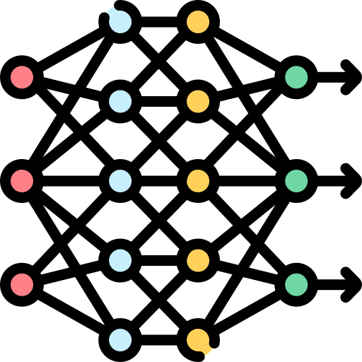

Hi 👋 My name is Alexander Brakas
=================================

Software Developer
------------------

* 🌍  I'm based in Mississauga
* ✉️  You can contact me at [abrakas@outlook.com](mailto:abrakas@outlook.com)
* 🧠  Aspiring Machine learning engineer

### 🛠️ Tech Stack

### Currently working on

<!-- 
assets credits:
Newpaper.png: https://www.flaticon.com/free-icon/newspaper_4363382
neuralnet.png https://www.flaticon.com/free-icon/deep-learning_8637101
-->

<!-- comment out badges for now
### Badges

<b>My GitHub Stats</b>

-->
### Socials

 <a href="https://www.github.com/AlexBrakas" target="_blank" rel="noreferrer"> <picture> <source media="(prefers-color-scheme: dark)" srcset="https://raw.githubusercontent.com/danielcranney/readme-generator/main/public/icons/socials/github-dark.svg" /> <source media="(prefers-color-scheme: light)" srcset="https://raw.githubusercontent.com/danielcranney/readme-generator/main/public/icons/socials/github.svg" />  </picture> </a> <a href="https://www.linkedin.com/in/alex-brakas" target="_blank" rel="noreferrer"> <picture> <source media="(prefers-color-scheme: dark)" srcset="https://raw.githubusercontent.com/danielcranney/readme-generator/main/public/icons/socials/linkedin-dark.svg" /> <source media="(prefers-color-scheme: light)" srcset="https://raw.githubusercontent.com/danielcranney/readme-generator/main/public/icons/socials/linkedin.svg" />  </picture> </a>

